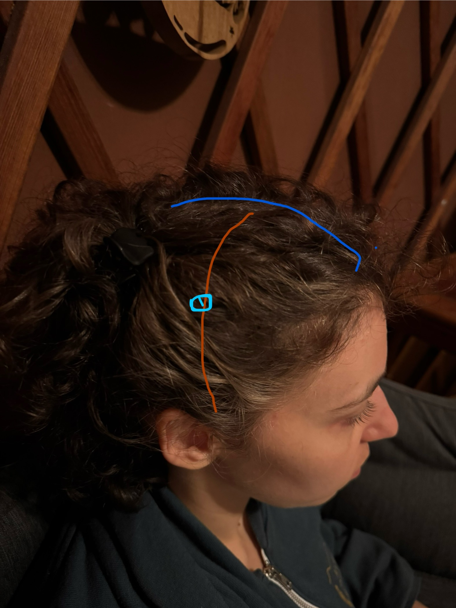
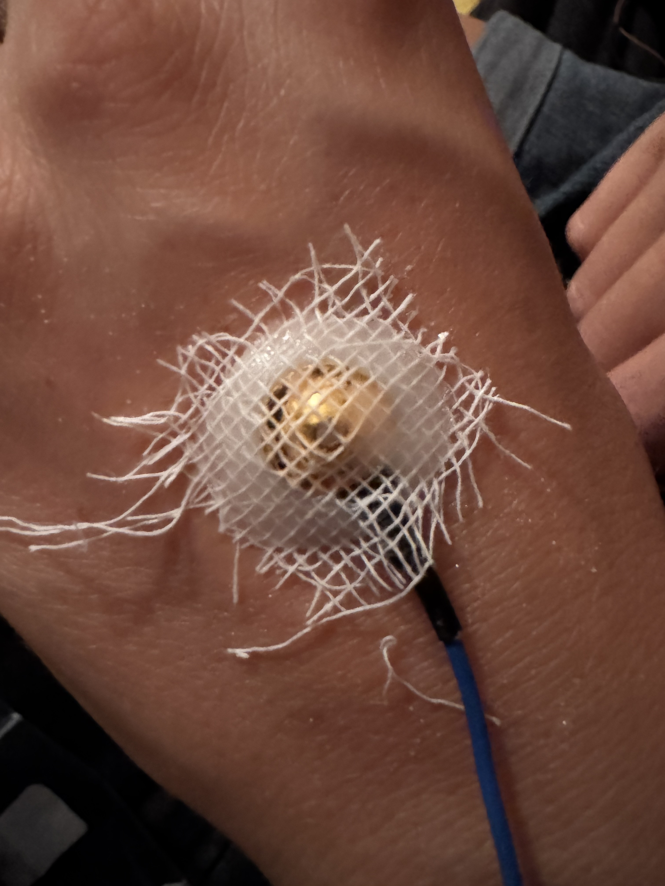
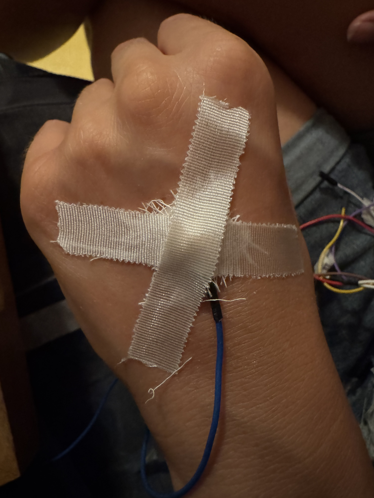

# OpenBCI Setup: Ganglion & Cyton

## Reference Pin and Noise-cancelling Pin Placement

| Ganglion Pin  | Cyton Pin             | Function             | Placement                            |
| ------------- | --------------------- | -------------------- | ------------------------------------ |
| REF (top pin) | SRB2 (bottom SRB pin) | Reference Pin        | right mastoid                        |
| D_G (top pin) | bottom BIAS pin       | Noise-cancelling Pin | right below widows peak, not in hair |

## A note on Ganglion Reference Switches

> There are 4 small slide switches (SW1, SW2, SW3, SW4) which can be set to connect the - inputs from the InAmps either to their associated - pin, or to the REF pin.
> 
>
> The default position for these switches when they are shipped to you is UP, which connects them to their associated differential channel - input pin on the bottom row of headers.
> -->
> 
>
> When you move the switch DOWN, that associated channel's - input is connected to the REF pin. This allows you to 'gang' some or all of the - pins together if you are doing something like reading EEG, or have any reason to combine two or more of the - pins.

## Electrodes Types

All the electrodes types (sticker, cup) should be the same as their reference for a good signal.

## Cyton: Placement of the electrodes

### Reference

Mastoid. Put the reference on the boniest part behind your right ear. Place th eelectrode higher up, like behind the midline of your ear otherwise you will get a heart artifact. Connect this electrode to the SRB on the cyton. Use the y splitter to connect the the electrode wire to the two prongs of the SRB on the cyton.

### Noise-cancelling Bias ("smart ground")

Put the electrode on the middle of your forehead. Connect to “Bias” on the cyton. Use the y splitter the same way as SRB, as described above.

#### The following are not precise measurements of the montage. Usually you do precise measurements, which are standardized, but the following is a heuristic.

### Montage Odd and Even Numbers

**Odd number:** _left_ side of your head.

**Even number:** _right_ side of your head.

### F3 and F4

These go approximately on your hair line, one above the pointy part of each eyebrow.

### C3 and C4

These go half way in between the center point of your head and the front cleavage of your ear.

### O1 and O2

Find the bump in the back of your head (occiput) then go an inch above it and the go a about inch and a half on either side of that point.

## Putting Electrodes on with Tape

Prep stage:

- Cut tape 1.5-2 inches
- Cut gauze squares if needed

- Put nuprep on paper towel to prep skin.
- Get q-tips

### Prep skin

1. Put nuprep on q-tip
2. Use the q-tip and nuprep to exfoliate the area where you are putting the lectrode.Exfoliate for 15 seconds in a circle and back and forth and side to side. Don’t leave a bunch of nuprep on the skin but you don’t need to take it all off. You need to part the hair where you are putting the electrode and don’t lose the part- you’ll need to put the electode exactly there.

3. Use the elctrode to pick up a pea size of ten20 conductive paste. stick it on the prepped skin with the wire of the electrode facing the nape of the neck so that you can put the wires in a ponytail. press down a little. then take gauze and place it on top. Place two fingers in the center and spread out and press down to adhere the gauze to the paste. The paste will grab the gauze. This is the main mechanism for the electrode to stick to the skin, but we are also going to add tape on top. Don’t press too hard on the actual electrode. It’s more of a smothing the paste outward movement so the paste catches on to the gauze. You want a layer of paste between the cup and the skin for conductivity.

4.  Then take the tape and put it corner to corner and do the same smoothing motion on the tape. Repeat for another peice of tape so that you make an x. When you do this on the hair, you need to part the hair as you put the tape on which can take a little bit of practice.

