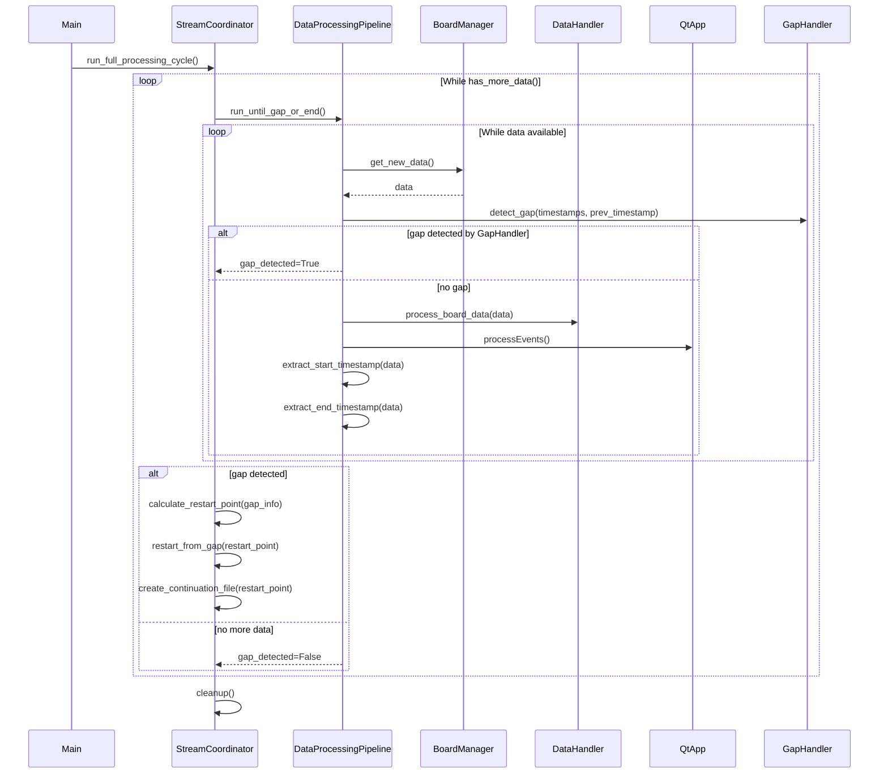

# Main Files Refactoring Notes

## Issue with this plan

WE realized that the plan does not take into account that the main.py and main_speed_controlled_stream.py are very different from each other. These plans are not clearly compatible with both architectures. First we need to refactor the main.py file and the main_speed_controlled_stream.py file to be a more similar. Then we should update the plan to be compatible with both architectures.

- [ ] Normalize main.py and main_speed_controlled_stream.py to be more similar
- [ ] Update refactor plan to be compatible with both normalized architectures

## Current Issues with main.py and main_speed_controlled_stream.py

These files are **application entry points/scripts** rather than traditional testable modules. They have several design issues that make them difficult to test and maintain.

### Problems with Current Design

1. **Monolithic main() functions** - Both have large, complex main functions that do too many things
2. **Hard-coded file paths** - They reference specific data files that may not exist in test environments
3. **External dependencies** - Rely on GUI components (PyQt), multiprocessing, and hardware simulation
4. **Side effects** - Create files, start processes, modify global state
5. **No return values** - Main functions don't return testable results
6. **Mixed responsibilities** - Orchestration logic mixed with business logic

### Current Architecture Problem

```python
# ORCHESTRATION (coordination) mixed with IMPLEMENTATION (business logic)
def main():
    # Setup (orchestration)
    board_manager = BoardManager(playback_file, board_id)
    board_manager.setup_board()

    # Business logic embedded in orchestration
    while True:
        new_data = board_manager.get_new_data()
        if new_data.size > 0:
            # Complex timestamp logic (implementation)
            if start_first_data_ts is None and board_timestamp_channel is not None:
                start_first_data_ts = float(new_data[board_timestamp_channel][0])

            # Gap detection logic (implementation)
            timestamps = original_playback_data.iloc[:, board_timestamp_channel]
            next_rows = timestamps[timestamps > last_good_ts]

            # File creation logic (implementation)
            create_trimmed_csv(playback_file, trimmed_file, offset)
```

## Proposed Refactoring: Separate Orchestration from Implementation

### Orchestration Layer (main.py)

Should only coordinate components - thin composition root:

#### Conceptual Example:

```python
def main():
    # Just coordinate components
    pipeline = DataProcessingPipeline(config)
    gap_handler = GapHandler(config)

    while pipeline.has_data():
        data = pipeline.get_next_batch()
        result = pipeline.process(data)

        if gap_handler.gap_detected(result):
            pipeline.restart_from_gap(gap_handler.get_restart_point())
```

### Implementation Layer (separate modules)

Contains the actual business logic:

```python
class DataProcessingPipeline:
    def process(self, data):
        # All the timestamp logic, data processing, etc.

class GapHandler:
    def gap_detected(self, result):
        # All the gap detection logic

    def get_restart_point(self):
        # All the offset calculation logic
```

## Benefits of Separation

1. **Testable**: You can test `DataProcessingPipeline.process()` without running the full app
2. **Focused**: Each class has one clear responsibility
3. **Reusable**: The implementation classes can be used in different contexts
4. **Maintainable**: Business logic changes don't affect orchestration and vice versa
5. **Configurable**: Dependencies can be injected for testing
6. **Modular**: Components can be developed and tested independently

## Refactoring Plan

1. **Extract business logic** into separate, focused classes
2. **Create smaller, testable functions** with clear inputs/outputs
3. **Use dependency injection** for file paths and external dependencies
4. **Separate concerns**: gap handling, data processing, file management, etc.
5. **Make main files thin orchestrators** that just wire components together

## Mermaid Diagram



## Control Flow Summary (with Method Names)

- `StreamCoordinator.run_full_processing_cycle()`
  - While `has_more_data()`:
    - Calls `DataProcessingPipeline.run_until_gap_or_end()`
      - Internally, this gets data (via `board_manager.get_new_data()` or `stream_manager.get_next_message()`) then calls `process_data_chunk(data)` repeatedly
      - Each chunk: calls `GapHandler.detect_gap(timestamps, prev_timestamp)` first
      - If gap detected: returns True with gap information stored in properties
      - If no gap: processes data and uses `extract_start_timestamp(data)` and `extract_end_timestamp(data)`
    - If a gap is detected:
      - Calculates restart point from gap information
      - Calls `restart_from_gap(restart_point)`
      - Calls `create_continuation_file(restart_point)`
    - Else, if no more data, break

## What Should Be Extracted

From the current main files, these concerns should be separate modules:

- **Gap Detection & Handling** - Logic for detecting data gaps and calculating restart points
- **File Management** - Creating trimmed files, managing offset files
- **Timestamp Processing** - All timestamp-related calculations and conversions
- **Stream Coordination** - Managing stream lifecycle and restart logic
- **Configuration Management** - Handling file paths, board settings, speed multipliers

The main files should become simple composition roots that instantiate and coordinate these components.

## Detailed Module Breakdown

### Core Modules Needed (3 main components):

#### 1. **DataProcessingPipeline** (Inner Loop - Data Processing)

- **Location**: `gssc_local/realtime_with_restart/data_processing_pipeline.py`
- **Single Responsibility**: Process individual data chunks within a single data acquisition session
- **Scope**: One continuous data stream until gap detected or end of data
- **Responsibilities**:
  - Process individual data chunks through board_manager → gap_detection → data_handler → visualizer flow
  - Handle the inner processing loop (get data, check for gaps, process if no gap, update GUI, repeat)
  - Extract and track timestamps from data chunks
  - Detect gaps in data stream using GapHandler
  - Detect when no more data is available in current session
  - Manage Qt event processing to keep GUI responsive
- **Key Methods**:
  - `process_data_chunk(data)` → bool (success/failure) - Low-level method that processes a single data chunk
  - `run_until_gap_or_end()` → ProcessingResult (with timestamps, chunk count, gap status) - High-level orchestration method that repeatedly calls `process_data_chunk()` until end of data
  - `extract_start_timestamp(data)` → Optional[float]
  - `extract_end_timestamp(data)` → Optional[float]

**Method Relationship**: `run_until_gap_or_end()` is the orchestrator that calls `process_data_chunk()` in a loop:

```python
def run_until_gap_or_end(self) -> ProcessingResult:
    chunks_processed = 0
    while True:
        new_data = self.board_manager.get_new_data()
        if new_data.size == 0:
            break  # No more data
        success = self.process_data_chunk(new_data)  # Calls low-level method
        if success:
            chunks_processed += 1
        time.sleep(self.loop_delay)
    return ProcessingResult(chunks_processed, self.start_timestamp, self.last_timestamp)
```

#### 2. **GapHandler**

- **Location**: `gssc_local/realtime_with_restart/gap_handler.py` _(already exists!)_
- **Purpose**: Detects gaps and calculates restart points
- **Responsibilities**:
  - Gap detection logic from main loop
  - Offset calculation for restart points
  - Timestamp comparison and validation
- **Key Methods**: `detect_gap()`, `get_restart_point()`, `calculate_offset()`

#### 3. **StreamCoordinator** (Outer Loop - Session Management)

- **Location**: `gssc_local/realtime_with_restart/stream_coordinator.py`
- **Single Responsibility**: Manage multiple data processing sessions across gaps and restarts
- **Scope**: Entire application lifecycle with multiple processing sessions
- **Responsibilities**:
  - Coordinate the outer restart loop from main()
  - Start/stop streams and stream managers for each session
  - Handle gap restart logic (not gap detection - that's done by DataProcessingPipeline)
  - Create continuation/trimmed CSV files for gap handling
  - Manage transitions between processing sessions
  - Orchestrate DataProcessingPipeline execution and respond to gap detection results
- **Key Methods**:
  - `run_full_processing_cycle()` → void (runs until all data processed)
  - `restart_from_gap(restart_point)` → void
  - `has_more_data()` → bool
  - `create_continuation_file(gap_info)` → str (new file path)

### Utility Modules to Extract:

#### 4. **TimestampUtils**

- **Location**: `gssc_local/realtime_with_restart/utils/timestamp_utils.py`
- **Purpose**: Timestamp processing utilities
- **Responsibilities**:
  - Format timestamps for display (`format_timestamp()`)
  - Format elapsed time (`format_elapsed_time()`)
  - Timestamp calculations and conversions
- **Key Methods**: `format_timestamp()`, `format_elapsed_time()`, `calculate_elapsed()`

### Existing Components to Leverage:

#### **CSVManager** _(already exists)_

- **Location**: `gssc_local/realtime_with_restart/export/csv/manager.py`
- **Purpose**: Handles all CSV data export and validation
- **Why not create FileManager**: CSVManager already handles all file operations needed for BrainFlow data export
- **Integration**: DataProcessingPipeline will use existing CSVManager instance from data_handler

## Refactored Architecture

### Concrete Implementation Plan:

```python
def main():
    # Core components using actual GapHandler interface
    gap_handler = GapHandler(sampling_rate=125.0, gap_threshold=2.0)  # Cyton+Daisy standard rate
    pipeline = DataProcessingPipeline(
        board_manager, data_handler, qt_app, gap_handler,
        loop_delay=0.1, timestamp_channel=board_timestamp_channel
    )
    stream_coordinator = StreamCoordinator(
        pipeline,
        playbook_file=playbook_file, board_id=board_id
    )

    # Thin orchestration loop
    while stream_coordinator.has_more_data():
        gap_detected = stream_coordinator.process_until_gap_or_end()

        if gap_detected:
            # Gap info is available from pipeline.gap_info (tuple from detect_gap)
            stream_coordinator.restart_from_gap(pipeline.gap_info)
        else:
            break  # End of data

    # Cleanup
    stream_coordinator.cleanup()
```

### Benefits of This Architecture:

- **Single Responsibility**: Each module has one clear purpose
- **Testable**: Each component can be unit tested independently
- **Dependency Injection**: Components receive their dependencies, making them configurable
- **Reusable**: Components can be used in different contexts (real vs simulated streams)
- **Maintainable**: Changes to business logic don't affect orchestration

## Test Plans for Refactored Components

### DataProcessingPipeline Tests

- **Basic functionality**: Can process data chunks and detect gaps using GapHandler
- **Integration**: Works with BoardManager, DataHandler, and Qt components
- **Edge cases**: Handles empty data and errors gracefully

### StreamCoordinator Tests

- **Session management**: Orchestrates multiple processing sessions across gaps
- **Gap handling**: Responds to gap detection and manages restarts
- **Integration**: Coordinates DataProcessingPipeline and file management

### Key API Methods:

**DataProcessingPipeline:**

- `run_until_gap_or_end()` → bool (gap detected)
- `process_data_chunk(data)` → bool (success)

**StreamCoordinator:**

- `run_full_processing_cycle()` → void
- `restart_from_gap(restart_point)` → void

## Simplified Interfaces

The refactored components will use simple return values and parameter passing, similar to the existing codebase:

## Error Handling Strategy

Follow existing codebase patterns:

- **Main files**: Single try/catch wrapper around processing loop with cleanup in finally
- **Components**: Log errors and re-raise for critical failures
- **Validation**: Early returns with error logging (no exceptions)
- **Cleanup**: Nested try/catch in finally blocks

This maintains consistency with current error handling approach.

### Configuration:

- Simple parameter passing following existing codebase patterns
- GapHandler uses actual constructor: `GapHandler(sampling_rate, gap_threshold)`
- Components receive configuration via \*\*kwargs

This separation ensures DataProcessingPipeline focuses on data processing within sessions, while StreamCoordinator handles the orchestration across multiple sessions and gap recovery.

## Implementation Checklist:

### TimestampUtils:

- [x] Add tests
- [x] create timestamp utils
- [x] remove hardcoded timestamp utils from main files
- [x] run tests and regression test

### DataProcessingPipeline:

- [ ] Write TDD tests for DataProcessingPipeline
- [ ] Implement DataProcessingPipeline to pass tests
- [ ] Extract data processing logic from main files to use DataProcessingPipeline
- [ ] Run tests and regression test
